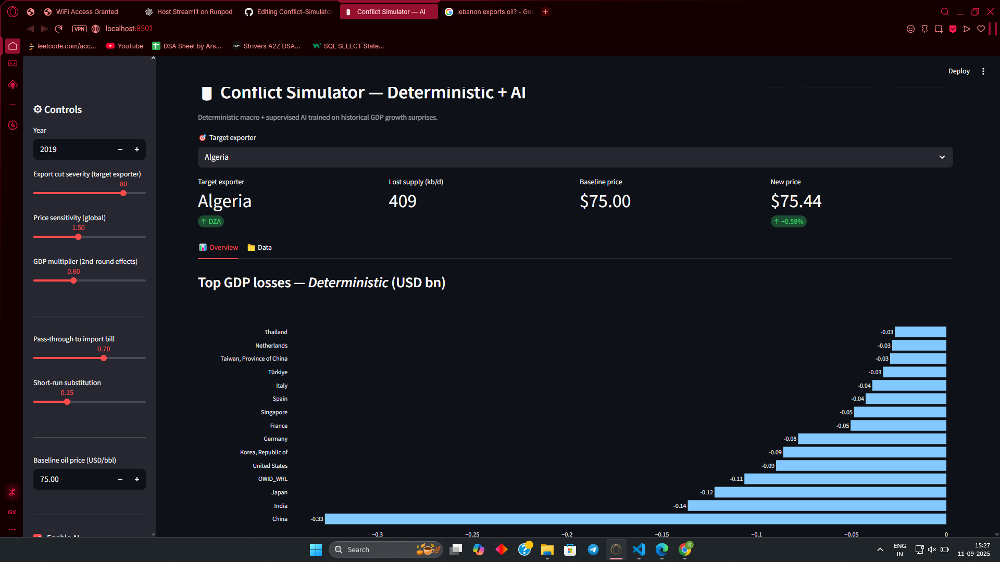

# 🛢️ Conflict Simulator Dashboard

> A Streamlit-powered interactive dashboard to simulate **economic impacts of commodity supply shocks** (oil, coal, gas) on countries worldwide.  

  
  
  
  

---

## 📸 Demo Preview

  

---

## ✨ Features

✅ Interactive **what-if analysis** of sanctions on resource-exporting countries  
✅ Choose **commodity type** (Oil, Coal, Gas)  
✅ Adjust **severity (%)** of supply cut  
✅ Visualize **oil price changes**  
✅ See **GDP impacts** on top affected countries  
✅ Dynamic **world map** heatmap of GDP shocks  
✅ Download **results as CSV**  

---

## 📊 System Flow

### User Insights ⚙️ Controls  
Commodities, Trade, and Impacts

⚙️ Controls

Commodity code (HS): e.g., 2709 for crude oil

Year: Select data year (2020–2024 supported in demo)

Export cut severity (%): Simulates sanctions severity

Price sensitivity factor: Determines oil price volatility

GDP impact multiplier: Adjusts GDP response

📈 Visuals

💥 Top GDP Losses → Horizontal bar chart

🗺️ World Map Heatmap → GDP change visualization

📉 Import Dependency vs GDP Change → Bubble chart

📑 Quick Table → Top 20 most impacted

🧠 Machine Learning Extension

Supports replacing static formulas with ML models:

GradientBoostingRegressor 🚀 (for sequential and random predictions and studying its implications for the real world)

📥 Data Sources

🌍 Our World in Data (OWID)
 – Oil, coal, gas data

📦 UN Comtrade
 – Trade statistics

💰 World Bank
 – GDP indicators

📝 Custom dataset – For extended commodities